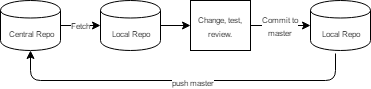
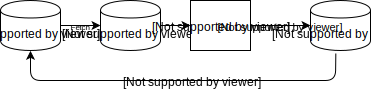

PNG and SVG Display Test
========================

The PNG in this directory is merely a rendering of SVG, which is the
the master diagram. Here they are displayed within the document:

PNG (inline Markdown):  

SVG (inline Markdown):  

HTML SVG, no width/height:
<figure>  </figure>

HTML SVG, with width/height:
<figure>  </figure>

GitLab Issues
-------------

This page doesn't work properly in GitLab: the PNG displays fine but
the SVG does not. (It works fine in GitHub, however.)

If you check the Network tab of Chrome's developer tools, you'll see
that the issue is that, while raw PNG objects are served with no
`Content-type` header (the browser automatically figures out that it's
type `png`), the raw SVG object is served with `Content-type:
text/html; charset=utf-8`. Thus, it doesn't display properly.

[Issue 30425] documents this, but after more than a year has had no
response. [Issue 9079] suggests serving all raw files with the
appropriate content-type, which does have security issues, as
documented in [merge request 2956][MR 2956]:

    # If we blindly set the 'real' content type when serving a Git blob we
    # are enabling XSS attacks. An attacker could upload e.g. a Javascript
    # file to a Git repository, trick the browser of a victim into
    # downloading the blob, and then the 'application/javascript' content
    # type would tell the browser to execute the attacker's Javascript. By
    # overriding the content type and setting it to 'text/plain' (in the
    # example of Javascript) we tell the browser of the victim not to
    # execute untrusted data.

[MR 2667] documents the issue with SVGs:

    # SVGs can contain malicious JavaScript; only include whitelisted
    # elements and attributes. Note that this whitelist is by no means complete
    # and may omit some elements.

And it does indeed seem to be incomplete: the SVG on this page is
displayed as a standalone image (when you click on the file directly)
but with all the text removed.

It appears unlikely that GitLab is ever going to properly display
PNGs, inline or standalone, so the [workarounds given on Stack
Overflow][ so29982037] appear to be what you'll have to do if you want
these displayed.

[issue 30425]: https://gitlab.com/gitlab-org/gitlab-ce/issues/30425
[issue 9079]: https://gitlab.com/gitlab-org/gitlab-ce/issues/9079
[mr 2667]: https://gitlab.com/gitlab-org/gitlab-ce/merge_requests/2667/diffs
[mr 2956]: https://gitlab.com/gitlab-org/gitlab-ce/merge_requests/2956/diffs
[so29982037]: https://stackoverflow.com/q/29982037/107294
